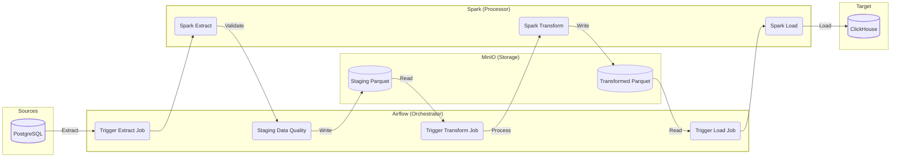

# ETL Pipeline: Postgres to ClickHouse

This project implements an ETL pipeline to transfer data from **PostgreSQL** to **ClickHouse** using **Apache Airflow** and **Apache Spark**. The pipeline leverages **MinIO** for raw and transformed storage in Parquet format.

---

## Architecture Overview

---

## Components

- **PostgreSQL**: Source transactional database.
- **Apache Airflow**: Orchestrates the ETL workflow.
- **Apache Spark**: Handles data extraction, transformation, and loading.
- **MinIO**: Stores intermediate Parquet files.
- **ClickHouse**: Analytics-optimized target database.

---

## ETL Steps

1. **Extract**: Data is read from PostgreSQL using Spark and saved as Parquet in MinIO.
2. **Data Quality**: Checks are performed on staging data.
3. **Transform**: Data is transformed using Spark and saved as Parquet in MinIO.
4. **Load**: Transformed data is loaded into ClickHouse.

---

## Technologies Used

- Apache Airflow
- Apache Spark
- PostgreSQL
- ClickHouse
- MinIO
- Docker

---

## Getting Started

1. Clone the repository.
2. Open terminal / command prompt and change directory to the project folder (`deso-query/`)
3. Build Airflow image with `docker build -t custom-airflow:latest -f Dockerfile.airflow .`
4. Build Livy image with `docker compose build livy`
5. Start services with `docker-compose up -d`.
6. Trigger the ETL DAG in Airflow.

---

For more details, see the [dags/dag_daily_transaction_summary.py](dags/dag_daily_transaction_summary.py)